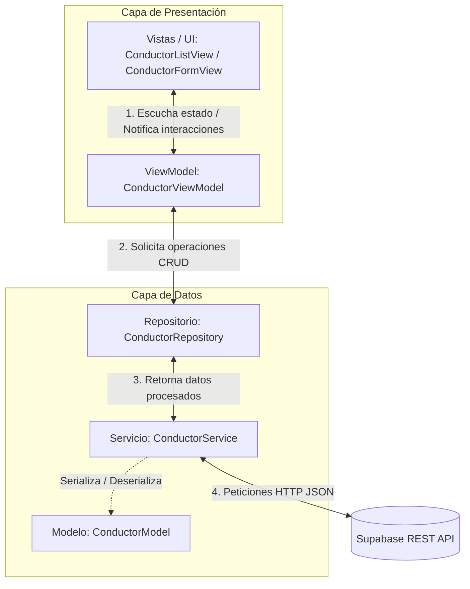

# Conductor Admin App (api_consumer)

Una aplicación móvil moderna desarrollada en Flutter para la administración, registro y control de conductores (`conductores`), conectada de forma directa a un backend en **Supabase** a través de su API RESTful.

El proyecto destaca por implementar una transición arquitectónica clara desde un diseño monolítico y acoplado hacia una arquitectura limpia bajo el patrón de diseño **MVVM (Model-View-ViewModel)**.

---

## Diagrama de la Arquitectura MVVM

El flujo de información en la nueva arquitectura es unidireccional y reactivo:



---

## Estructura de Directorios

El código fuente en `lib/` está organizado bajo la estructura recomendada para proyectos escalables en Flutter:

```text
lib/
├── data/                       # Capa de Datos
│   ├── models/                 # Modelos de datos y mapeos JSON
│   │   └── conductor_model.dart
│   ├── repositories/           # Abstracciones y lógica de negocio de datos
│   │   └── conductor_repository.dart
│   └── services/               # Clientes API y persistencia cruda
│       └── conductor_service.dart
├── ui/                         # Capa de Interfaz de Usuario
│   ├── core/                   # Estilos, temas globales y constantes visuales
│   │   └── theme.dart
│   └── features/               # Módulos del negocio organizados por funcionalidad
│       └── conductor/          # Módulo de administración de conductores
│           ├── view_models/    # Controladores de UI y gestores de estado (ChangeNotifier)
│           │   └── conductor_view_model.dart
│           └── views/          # Widgets visuales y layouts de pantalla
│               ├── conductor_form_view.dart
│               └── conductor_list_view.dart
├── pages/                      # Vistas antiguas de la arquitectura Legacy (Acopladas)
│   ├── conductor_form.dart
│   └── conductor_list.dart
├── models/                     # Modelos de datos antiguos
│   └── conductor_model.dart
├── services/                   # Servicios de datos antiguos
│   └── conductor_service.dart
└── main.dart                   # Punto de entrada de la aplicación
```

---

## Desglose de Componentes y Lógica

### 1. Capa de Datos (Data Layer)

* **Modelo ([conductor_model.dart](lib/data/models/conductor_model.dart)):** Define la entidad `ConductorModel` con campos inmutables (`idConductor`, `nombreCompleto`, `licenciaConducir`, `telefono`, `fechaContratacion`). Contiene fábricas de deserialización JSON (`fromJson`) y métodos de serialización (`toJson`), además del método helper `copyWith` para clonar objetos modificando propiedades específicas.
* **Servicio ([conductor_service.dart](lib/data/services/conductor_service.dart)):** Encargado de realizar peticiones HTTP (`http.get`, `http.post`, `http.patch`, `http.delete`) contra el endpoint REST de Supabase. Gestiona de manera automática las cabeceras requeridas (`apikey` y token `Bearer`), resuelve conflictos de URLs y aplica políticas de representación preferente (`Prefer: return=representation`).
* **Repositorio ([conductor_repository.dart](lib/data/repositories/conductor_repository.dart)):** Implementa el patrón Repository actuando como intermediario. Recibe peticiones del ViewModel y las delega al `ConductorService`. Esto permite cambiar el origen de datos (por ejemplo, a una base de datos local SQLite o Hive) en un solo archivo sin alterar la UI.

### 2. Capa de UI / Presentación (UI Layer)

* **ViewModel ([conductor_view_model.dart](lib/ui/features/conductor/view_models/conductor_view_model.dart)):** Hereda de `ChangeNotifier` y maneja el estado de la pantalla. Expone:
  * El listado de conductores (`conductors`).
  * Indicadores de carga (`isLoading`) y mensajes de error (`error`).
  * Métodos asíncronos para cargar datos (`fetchConductors`), eliminar (`deleteConductor`) y crear/editar (`saveConductor`).
  * Emisión de actualizaciones a través de `notifyListeners()` para indicar a las vistas cuándo redibujarse.
* **Vistas:**
  * **[conductor_list_view.dart](lib/ui/features/conductor/views/conductor_list_view.dart):** Pantalla principal. Utiliza un `ListenableBuilder` suscrito al `ConductorViewModel` para escuchar cambios. Implementa búsqueda local interactiva, pull-to-refresh, cards con degradados elegantes y gestos de eliminación.
  * **[conductor_form_view.dart](lib/ui/features/conductor/views/conductor_form_view.dart):** Formulario para añadir o actualizar conductores. Cuenta con validadores de campos de texto, integración con selectores de fechas y manejo del estado de guardado directo mediante el ViewModel.
* **Diseño Core ([theme.dart](lib/ui/core/theme.dart)):** Provee un diseño premium basado en una paleta de colores oscura (*Midnight Dark*), combinando tonos Indigo, Violet y Cyan para lograr una interfaz visual atractiva con bordes redondeados y microinteracciones de entrada táctil.

---

## Configuración y Conexión a Supabase

La aplicación se comunica directamente con las tablas de Supabase utilizando la API REST que este autogenera. La configuración se establece en las constantes de [lib/data/services/conductor_service.dart](lib/data/services/conductor_service.dart):

```dart
static const String supabaseUrl = 'https://wmdhptmfyqkgpwvizlmx.supabase.co/rest/v1/';
static const String anonKey = 'YOUR_SUPABASE_ANON_KEY';
static const String tableName = 'conductores';
```

### Cabeceras HTTP Requeridas
Supabase requiere autenticar cada petición HTTP a través de cabeceras. El servicio configura estas de la siguiente manera:
* `apikey`: La clave pública anonimizada (`anonKey`).
* `Authorization`: Token en formato `Bearer [anonKey]`.
* `Prefer`: Configurado en `return=representation` para peticiones de escritura (`POST` / `PATCH`), solicitando a Supabase retornar el registro creado o actualizado en el cuerpo de la respuesta.

---

## Instalación y Uso

### Prerrequisitos
* Tener instalado el SDK de Flutter (versión `>=3.12.1`).
* Un emulador configurado o dispositivo físico para pruebas.

### Configuración del Proyecto
1. Clona este repositorio en tu máquina local.
2. Instala las dependencias del proyecto ejecutando:
   ```bash
   flutter pub get
   ```
3. Ejecuta la aplicación en modo debug en tu dispositivo/emulador:
   ```bash
   flutter run
   ```
